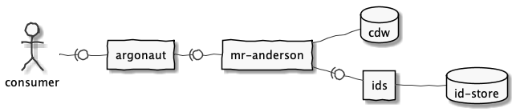

# health-apis

This project encapsulates the Health APIs with a focus on 
[Argonaut](http://www.fhir.org/guides/argonaut/r2/profiles.html) compliance.

###### Health API applications

----

## Building
- [Java Development Kit](https://openjdk.java.net/) 8
- [Maven](http://maven.apache.org/) 3.5
- [PlantUml](http://plantuml.com/) for diagrams
- Recommended [IntelliJ](https://www.jetbrains.com/idea/) 
  or [Eclipse](https://www.eclipse.org/downloads/packages/installer)
  with the following plugins
  - [Lombok](https://projectlombok.org/)
  - [Google Java Format](https://github.com/google/google-java-format)
    

#### Maven
- Formats Java, XML, and JSON files
  (See the [Style Guide](https://google.github.io/styleguide/javaguide.html))
- Enforces unit test code coverage
- [Checkstyle](http://checkstyle.sourceforge.net/) analysis using Google rules
- [SpotBugs](https://spotbugs.github.io/) analysis 
  with [Find Security Bugs](http://find-sec-bugs.github.io/) extensions
- Git branch naming conventions to support Jira integration

The above build steps can be skipped for use with IDE launch support by disabling the
_standard_ profile, e.g. `mvn -P'!standard' package` 